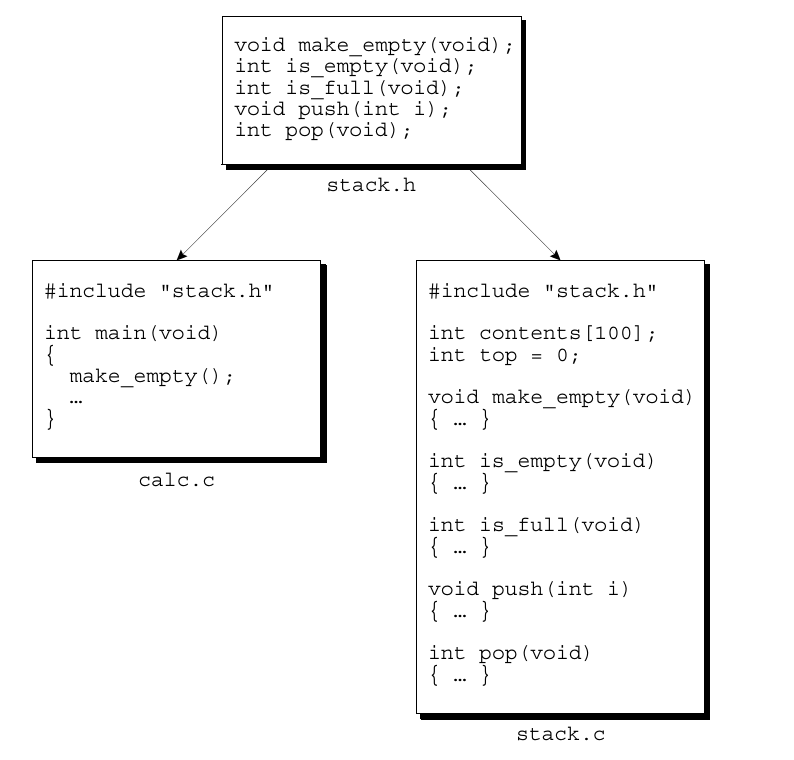

## Terminology

- Function, Var declaration tells the compiler about a function's name, return type, and parameters.
- Function, Var definition provides the actual body of the function.  

- Source files (.c extension): contains part of the program
    - Put functions, variables definition in here
- Header files (.h extension): files that are included in another program.
    - Put functions, variables declaration in here





- Declare variable without defining it

```c
extern int i
extern int a[]
// These are shared variables ()
// compiler doesn't allocate space for this
// extern informs the compiler that i is defined elsewhere in the program (most likely in a different source file) 
```


